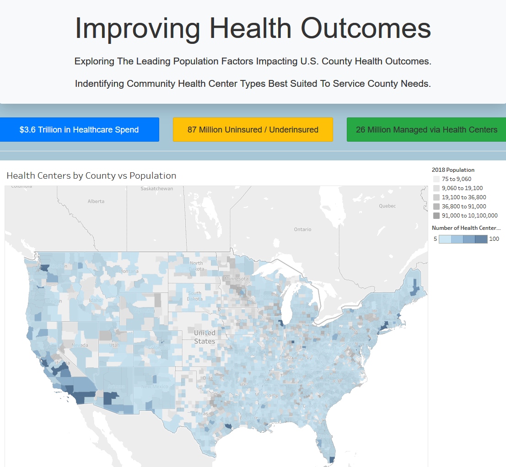

# DemoDay2020

# Authors
This website/Flask application/machine learning site was constructed by:

Raquel McLellan
Jessica Carns
Eliana Suarez
Solicia Xu
Steven J. Bark

All Copyrights Reserved.

# Description
Federally-funded local community and regional healthcare clinics are critical infrastructure for the healthcare of
millions of Americans. As the COVID-19 Pandemic has revealed, these clinics have not been maintained at the appropriate
level of effectiveness or funding. This project evaluated local community and regional healthcare clinics, geographical
locations, health metrics at the county and state level, and employed machine learning algorithms to calculate clinic
types and important health metrics.

Local Community and Regional Health Clinics
State Maps
County Maps
Calculators for Clinic Types and Health Metrics (K Nearest Neighbors and Randome Forest Regression)
Clinics in Crisis: COVID-19 Dashboard

# Deployment
This website required Flask for deployment. After Flask installation, the website repository can be copied to your local
computer and deployed directly. Future deployment on Heroku is planned.

# Tools
Python, Pandas, NumPy, Keras Machine Learning, Flask, MongoDB, HTML, CSS, JavaScript, Tableau